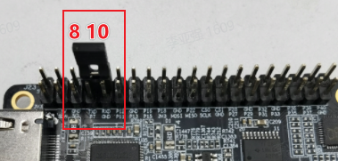

# 3.3.4 串口应用

RDK X3在40PIN上默认使能 UART3，物理管脚号 8 和 10，IO电压 3.3V。

RDK Ultra在40PIN上默认使能 UART2，物理管脚号 8 和 10，IO电压 3.3V。

请参阅 `/app/40pin_samples/test_serial.py`了解如何使用串口的详细信息。

## 回环测试
把TXD和RXD在硬件上进行连接，然后运行测试程序，进行写和读操作，预期结果是读出的数据要完全等于写入的数据

### 硬件连接

把TXD和RXD通过跳线帽直接硬件上连接在一起



### 测试过程

- 运行 `python3 /app/40pin_samples/test_serial.py`
- 从打印的串口设备（其中/dev/ttyS0是系统调试口，不建议对它进行测试，除非你完全明白它的作用）中选择总线号和片选号作为输入选项，例如选择测试 `/dev/ttyS3`，按回车键确认，并输入波特率参数：

```
List of enabled UART:
/dev/ttyS0  /dev/ttyS1  /dev/ttyS3  /dev/ttyUSB0

请输出需要测试的串口设备名:/dev/ttyS3
请输入波特率(9600,19200,38400,57600,115200,921600):921600
Serial<id=0x7f819dcac0, open=True>(port='/dev/ttyS3', baudrate=921600, bytesize=8, parity='N', stopbits=1, timeout=1, xonxoff=False, rtscts=False, dsrdtr=False)
```

- 程序正确运行起来后会持续打印 `Send: AA55` 和 `Recv:  AA55`：

```
Starting demo now! Press CTRL+C to exit
Send:  AA55
Recv:  AA55
```

## 测试代码

```python
#!/usr/bin/env python3

import sys
import os
import time

# 导入python串口库
import serial
import serial.tools.list_ports

def serialTest():
    print("List of enabled UART:")
    os.system('ls /dev/tty[a-zA-Z]*')
    uart_dev= input("请输出需要测试的串口设备名:")

    baudrate = input("请输入波特率(9600,19200,38400,57600,115200,921600):")
    try:
        ser = serial.Serial(uart_dev, int(baudrate), timeout=1) # 1s timeout
    except Exception as e:
        print("open serial failed!\n")

    print(ser)

    print("Starting demo now! Press CTRL+C to exit")

    while True:
        test_data = "AA55"
        write_num = ser.write(test_data.encode('UTF-8'))
        print("Send: ", test_data)

        received_data = ser.read(write_num).decode('UTF-8')
        print("Recv: ", received_data)

        time.sleep(1)

    ser.close()
    return 0


if __name__ == '__main__':
    if serialTest() != 0:
        print("Serial test failed!")
    else:
        print("Serial test success!")

```
