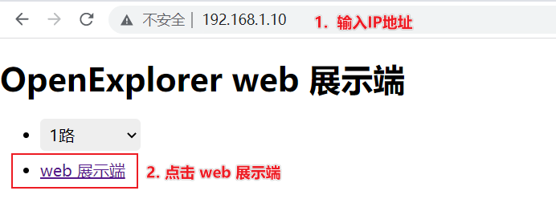

# 4.1.5 基于MIPI摄像头推理

## 目标检测算法—fcos

本示例主要实现以下功能：

1. 加载`fcos` 图像目标检测算法模型（基于COCO数据集训练的80个类别的目标检测）
2. 从MIPI摄像头读取视频图像，并进行推理
3. 解析模型输出并将结果渲染到原始视频流
4. 通过`HDMI`接口输出渲染后的视频流。

### 运行方法

请查阅 [MIPI摄像头AI推理](/first_application/mipi_camera) 了解如何快速运行本示例。

### 示例代码解析

- 导入python模块
  导入hobot_dnn、hobot_vio、numpy、opencv模块、colorsys等模块

    ```python
    import numpy as np
    import cv2
    import colorsys
  
    from hobot_dnn import pyeasy_dnn as dnn
    from hobot_vio import libsrcampy as srcampy
    ```

- 加载模型文件

    调用[load](/python_development/pydev_dnn_api)方法加载模型文件，并返回一个 `hobot_dnn.pyeasy_dnn.Model` 类的 list。

    ```shell
    models = dnn.load('../models/fcos_512x512_nv12.bin')
    ```

    `fcos`模型的输入是`1x3x512x512`数据，格式为`NCHW`。输出为15组数据，用来表示检测到的物体检测框。示例中定义了`print_properties`函数用来输出模型的输入、输出参数：

    ```python
    # print properties of input tensor
    print_properties(models[0].inputs[0].properties)
    # print properties of output tensor
    print(len(models[0].outputs))
    for output in models[0].outputs:
        print_properties(output.properties)
    ```

- 数据预处理

    调用`srcampy.Camera`类`get_cam`接口，获取MIPI camera的实时图像，并把图像缩放到符合模型输入tensor的尺寸

    ```python
    # create Camera object
    cam = srcampy.Camera()
    h, w = get_hw(models[0].inputs[0].properties)
    # open MIPI Camera, set 30fps，solution 1920 x 1080, 512 x 512
    cam.open_cam(0, 1, 30, [1920, w], [1080, h])
    ```

    ```python
    # get the image, solution 512x512
    img = cam.get_img(2, 512, 512)
    # transform data to np format
    img = np.frombuffer(img, dtype=np.uint8)
    ```

- 数据流绑定

    为减少图像数据的拷贝, 示例将图像数据的输入、输出模块进行了绑定, 可以在底层将`camera`的图像数据直接送到`display`显示模块

    ```python
    disp = srcampy.Display()
    # For the meaning of parameters, please refer to the relevant documents of HDMI display
    disp.display(0, 1920, 1080)

    # bind camera directly to display
    srcampy.bind(cam, disp)
    ```

    关于camera详细使用方法，可以查看[Camera章节](../pydev_multimedia_api_x3/object_camera.md)了解更多信息。

- 模型推理

    调用 [Model](../pydev_dnn_api#model) 类的 `forward` 接口进行推理，模型输出15组数据，用来表示检测到的物体检测框。

    ```python
    outputs = models[0].forward(nv12_data)
    ```

- 算法后处理

    示例中的后处理函数`postprcess`，会处理模型输出的物体类别、检测框、置信度等信息。
    ```python
    # do postprocess
    prediction_bbox = postprocess(outputs, input_shape, origin_img_shape=(1080,1920))
    ```

- 检测结果可视化

    示例对算法结果和原始视频流进行了渲染，并通过`HDMI`接口输出，用户可在显示器上实时预览效果。显示部分用到了hobot_vio模块的Display功能，该模块详细信息请查看 [Display章节](../pydev_multimedia_api_x3/object_display.md)。

    ```python
    for index, bbox in enumerate(prediction_bbox):
    ...
        if index == 0:
            disp.set_graph_rect(coor[0], coor[1], coor[2], coor[3], 2, 1,
                                box_color_ARGB)
            disp.set_graph_word(coor[0], coor[1] - 2, bbox_string, 2, 1,
                                box_color_ARGB)
        else:
            disp.set_graph_rect(coor[0], coor[1], coor[2], coor[3], 2, 0,
                                box_color_ARGB)
            disp.set_graph_word(coor[0], coor[1] - 2, bbox_string, 2, 0,
                                box_color_ARGB)
    
    ```

## 目标检测算法 Web端可视化

本示例我们要实现：

1. 加载 `fcos` 图像目标检测算法模型（基于COCO数据集训练的80个类别的目标检测）
2. 从MIPI摄像头、读取视频图像，并进行推理
3. 解析模型输出结果
4. 推送算法结果、视频流到web端

本示例中数据预处理、模型推理以及后处理部分代码与上一章节一致，下面只解析差异部分。

### 代码解析

- 启动`web_service`服务

    在使用web服务之前，请确保开发板与电脑处于同一网段，并可以相互ping通。然后执行如下命令启动web服务

    ```bash
    cd /app/pydev_demo/05_web_display_camera_sample/
    sudo sh ./start_nginx.sh
    sudo python3 ./mipi_camera_web.py 
    ```

    注意，如果在运行`start_nginx.sh`时报以下错误，说明设备上已经有运行httpd的服务，tcp的80端口已经被占用
    

    此时需要找到并结束掉占用`80`端口的进程，可以执行命令`lsof -i:80`，得到占用端口的进程PID，并用`kill -9 PID`结束掉进程即可。

- protobuf序列化

    web端接收的是使用protobuf序列化之后的数据，开发板作为服务端需要将模型输出按照一定的数据格式进行序列号，本示例中通过`serialize`函数完成序列化操作

    ```python
    def serialize(FrameMessage, prediction_bbox):
        if (prediction_bbox.shape[0] > 0):
            for i in range(prediction_bbox.shape[0]):
                # get class name
                Target = x3_pb2.Target()
                id = int(prediction_bbox[i][5])
                Target.type_ = classes[id]
                Box = x3_pb2.Box()
                Box.type_ = classes[id]
                Box.score_ = prediction_bbox[i][4]

                Box.top_left_.x_ = prediction_bbox[i][0]
                Box.top_left_.y_ = prediction_bbox[i][1]
                Box.bottom_right_.x_ = prediction_bbox[i][2]
                Box.bottom_right_.y_ = prediction_bbox[i][3]

                Target.boxes_.append(Box)
                FrameMessage.smart_msg_.targets_.append(Target)
        prot_buf = FrameMessage.SerializeToString()
        return prot_buf
    ```

- protobuf数据包发送

    开发板web服务端通过`websockets`插件完成对数据的发送，需要获取本机IP地址：

    ```python
        # call ifconfig cmd, to get device ip
        ifconfig_cmd = subprocess.check_output("ifconfig | grep broadcast | awk '{print $2}'", shell=True)
        board_ip = str(ifconfig_cmd, 'UTF-8')[:-1]
    ```

    然后启动`websockets`，并通过数据发送函数`web_service`发送数据。

    ```python
    start_server = websockets.serve(web_service, board_ip, 8080)
    ```

    ```python
    async def web_service(websocket, path):
        while True:
            # create protobuf message object
            FrameMessage = x3_pb2.FrameMessage()
            # set frame solution and format
            FrameMessage.img_.height_ = 1080
            FrameMessage.img_.width_ = 1920
            FrameMessage.img_.type_ = "JPEG"
    
            # get camera image for inference
            img = cam.get_img(2, 512, 512)
            img = np.frombuffer(img, dtype=np.uint8)
            outputs = models[0].forward(img)
            # do postprocess
            prediction_bbox = postprocess(outputs, input_shape, origin_img_shape=(1080, 1920))
            print(prediction_bbox)

            # get camera image for render
            origin_image = cam.get_img(2, 1920, 1080)
            # encode image to mjpeg
            enc.encode_file(origin_image)
            FrameMessage.img_.buf_ = enc.get_img()
            FrameMessage.smart_msg_.timestamp_ = int(time.time())
            # serialize data
            prot_buf = serialize(FrameMessage, prediction_bbox)
            # send data
            await websocket.send(prot_buf)
        cam.close_cam()
    ```

- web端查看展示效果

    在`chrome`浏览器输入开发板IP地址，即可实时预览渲染后的视频画面  
    

